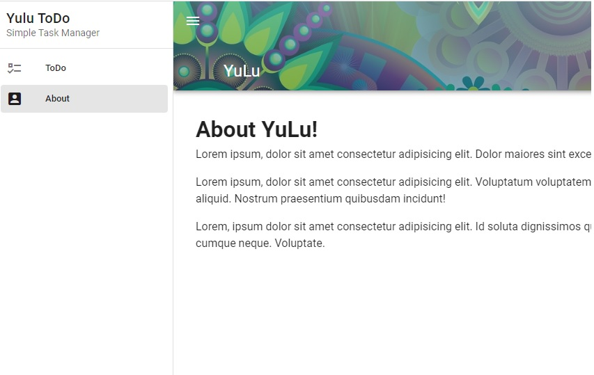
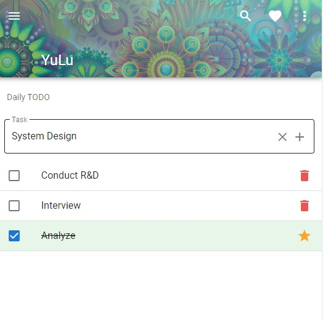
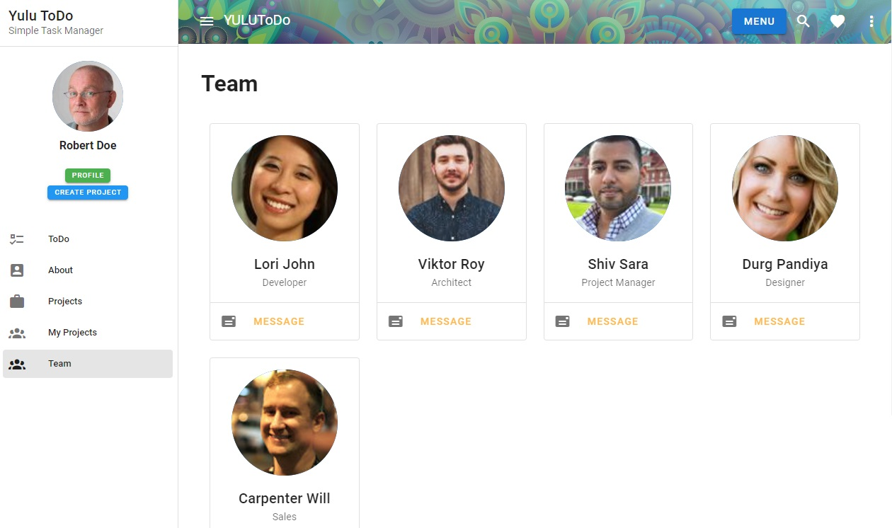
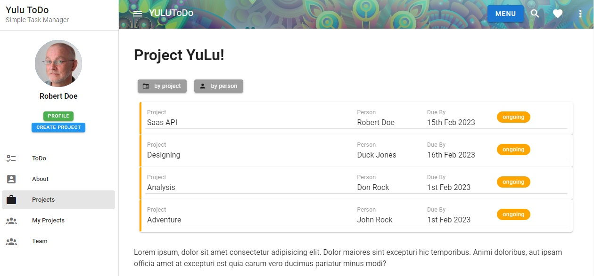
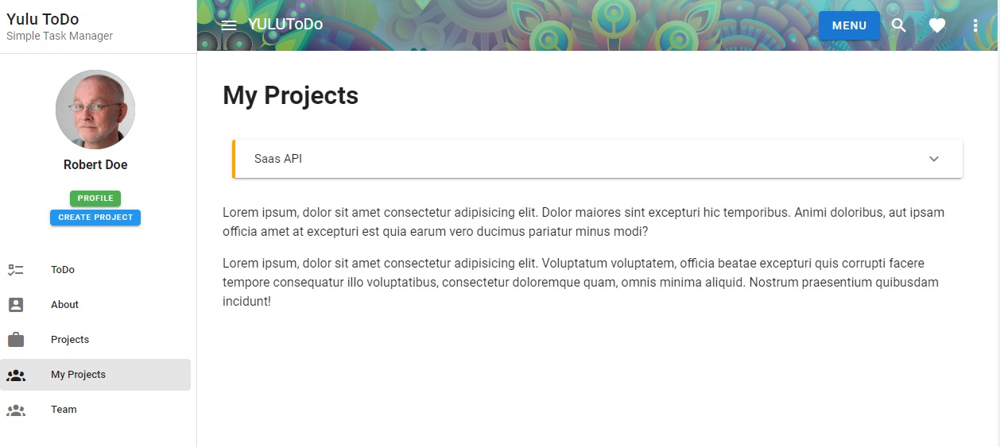

### BasicVuetify
Vuetify Beginner Tutorial - Material Design component framework for Vue.js. It is a UI component library based on Google's Material Design specifically designed for Vue.js to make websites nice and clean.


### References
* Vue Getting Started: https://cli.vuejs.org/#getting-started
* Vuetify Library: https://vuetifyjs.com/en/
* YouTube: https://www.youtube.com/watch?v=CjXgoYo86yY
* Vuetify Wireframes: https://vuetifyjs.com/en/getting-started/wireframes/
* Random background pictures: https://picsum.photos/1920/1080?random
* Random user picture: https://randomuser.me/api/portraits/men/1.jpg
* Vuetify tuite: https://www.youtube.com/watch?v=2uZYKcKHgU0&list=PL4cUxeGkcC9g0MQZfHwKcuB0Yswgb3gA5 
### Local Setup
* NodeJS v14.20.1
* Vue 2.6.14
* Vue/cli 5.0.8
* Vuetify 2.6.0 (Reference: https://vuetifyjs.com/en/components/tooltips/#alignment)
* Install date-fns from npm for date formatting  
```

$ npm install -g @vue/cli
OR
$ yarn global add @vue/cli

If you want to remove an old version, 
$ yarn global remove vue-cli
OR
$ npm uninstall -g vue-cli

To get to know the versions
$ npm v vue
$ vue --version

Now, create a new project
$ vue create vuetify-todo
[Options: Vue2 and npm]

$ cd vuetify-todo

Now, add vuetify plugin (you will see this plugin under the src/plugins folder)
$ vue add vuetify

$ npm run serve
```

* In this tutorial, we will be using the Base template from https://vuetifyjs.com/en/getting-started/wireframes/ (there is github link at the bottom of the template page which you can use to copy the code)
* Replace App.vue with the base template code from github URI
* Add Navigation to the base wireframe by going to UI Components > Navigation Drawers
* Check if vue router is already installed (there will be a router folder in the project), if not
```
$ vue add router
```
* If we are using vue-router, we will need to add <router-view> inside <v-main>. To read more you can go to Vuetify documentation, UI Components > Application 
* For Material design icons, 
* For styling the design of the form, go to Styles and animations > spacing
* To improve the header of the wireframe, let's go to UI Components > Bars > App bars
* To display list of todo's, go to UI Components > Lists 






* Firebase provides a back-end as a service to our apps.
* Firestore is one of the service provided by Firebase. A NoSQL database to store data in.
* Contains collections of documents
* Allows us to update data store in real time
* In the application, we will have collection of projects stored in FireStore. Each collection will have a unique identifier.
  ```
  To use firebase in the project,
    $ yarn add firebase
  ```
* Go to Firebase > Project overview and select the config setting (</>)









#### Things to do
* When there are no tasks, display 'No Tasks' message with an icon
* In the ToDo display, add a snackbar at the bottom of the window and make it disappear after few seconds
* For each task, add a menu to the right with four different options (Edit, Due Date, Delete, Sort). Each task should be able to perform its function
  * Edit task
  * Add due date with date picker modal window. Once date is added, display it next to the task in smaller font (calendar icon Mon dd)
  * Delete task which will open up a confirm dialog asking you if you really want to delete the task
  * Sort option when clicked will open up drag handles which can help you sort out task display
  * In the NavBar add in live date and time
  * Move add a task text field to the pin up nav bar in the top
  * Add in a search bar at the top which will open up a search text field allowing you to narrow down the tasks from the list
  * Adding localbase to the project  - offline database with the simplicity & power of Firebase, all stored in the user's browser (in an IndexedDB database). Reference: https://www.youtube.com/watch?v=KJnupY2HPCg
  